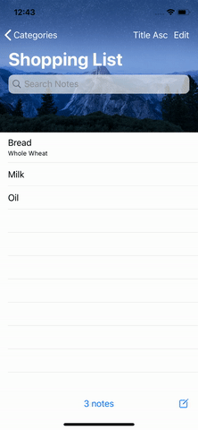

# Todo-iOS-App
This is an iOS application where the users can manage a list of TODOs and Notes.
Advanced iOS Development Final Assignment. This is an iOS application, created as an Assignment. 
Requirements
* User should be allowed to sort tasks by title or by date/time that were created.
* User should also be allowed to search for specific task by title or by keyword that may be
contained in a task description.
* User should be able to edit or delete the task. User should be able to modify the due date
of the task (e.g. add a day for the task that he/she is working on by swiping the cell).
* User should be able to change the category of the task.
* When the task is due, the cell should be displayed in green color and if the task is overdue
the cell should be displayed in red.
* The user should get notified when the task is due. The user could get notified a day before
the due date too if you want so.
* The user should be able to mark a task as completed. In this case the task should be moved
to a default folder named “Archived”.

  
Splash Screen for the App:
 

  
Adding Category:
 

  
Adding Note:
 
Basic Note | Note with Details | Details
------------ | ------------- | -------------
 |  |  The Application adds Note as an Reminder in Calendar, to notify the User a day before.   The Application on startup also shows the due notes if any.

  
Note Colors:
 

  
Edit Notes:
 

  
Move Notes:
 

&emsp; &emsp;

  
Delete Notes:
 

&emsp; &emsp;

  
Marking Note as Completed:
 

  
Swipe to Add a day to Note:
 

  
Notification of Due Notes Notes:
 

&emsp; &emsp;

  
Search Categories and Notes:
 

&emsp; &emsp;

  
Sort Notes on the basis of Title and Date, Ascending or Descending:
 

